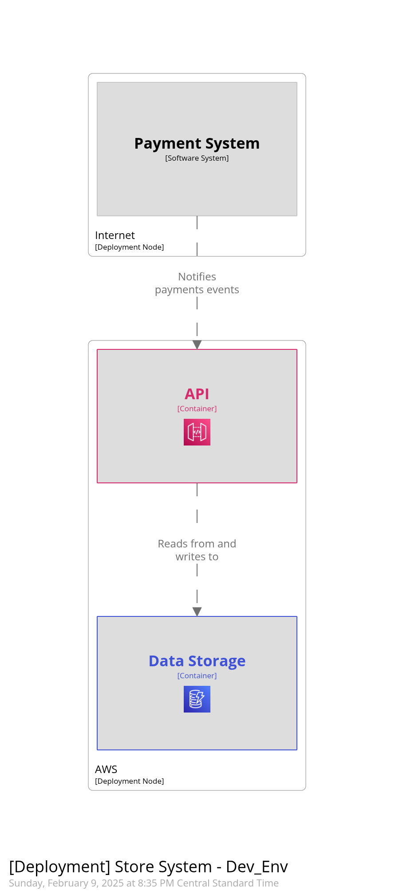

# Receive clip web hook

This is a sample webhook receiver for clip.mx payment results. Infrastructure is deployed to an AWS Account with terraform. The Payload is received in an AWS API Gateway which uses direct DynamoDB integration to store the payload and important fields without the need to use additional compute mechanisms. This is so far the simplest way to develop such solution and it can be deployed in minutes.

Documentation is being done with Structurizer and can be found on `structurizer` folder.

Sample payloads are on `examples` folder.

## Utilization

Deploy with terraform to an aws account.

    terraform apply -var profile=<the_name_of_a_profile>

This should yield something similar to the following output:

    Plan: 16 to add, 0 to change, 0 to destroy.

        Changes to Outputs:
        + api = (known after apply)

        Do you want to perform these actions?
        Terraform will perform the actions described above.
        Only 'yes' will be accepted to approve.

        Enter a value: 

Confirm with "yes" and infrastructure will be deployed on your AWS Account. After a couple of minutes you should see the following output:

    Apply complete! Resources: 16 added, 0 changed, 0 destroyed.

    Outputs:

    api = "https://<random>.execute-api.us-east-1.amazonaws.com/dev"

Take note of that url as it is the base where the url where webhooks will be listening.

You can then test by running the following command:

    ./test-deployment.sh

You should see the following output:

    {}{}{}

* TODO: Change test script to add verbose output instead of plain result from API.
* TODO: Add response mapping template for erroneous requests.